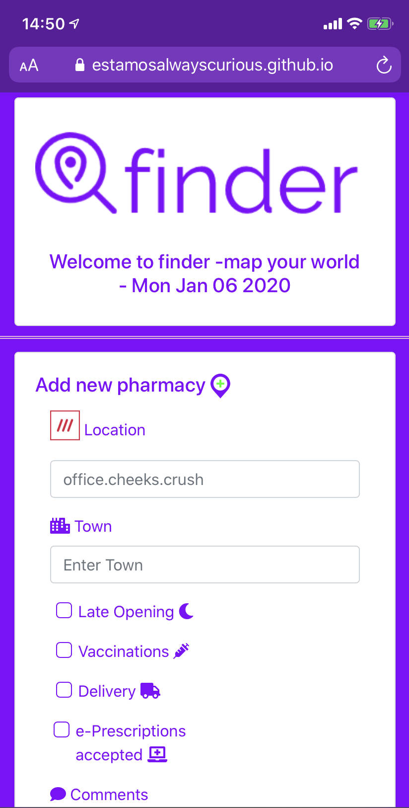
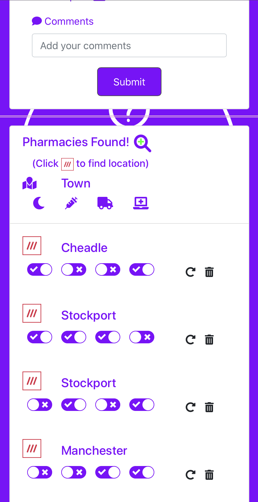
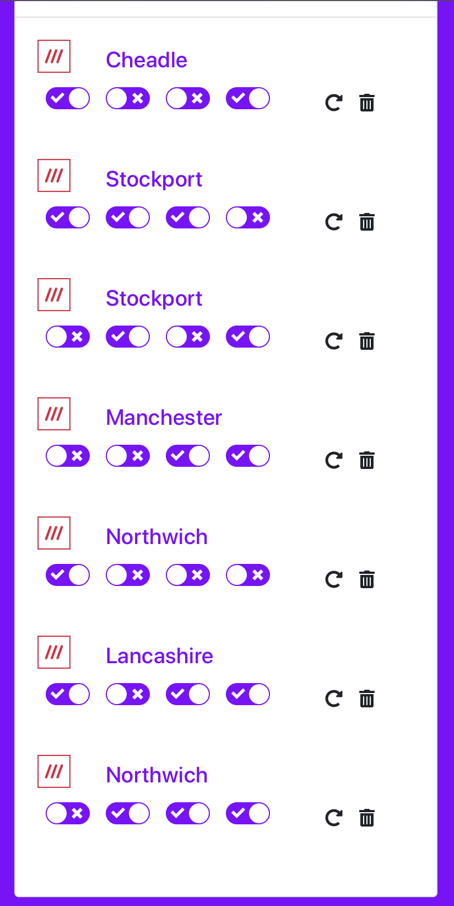
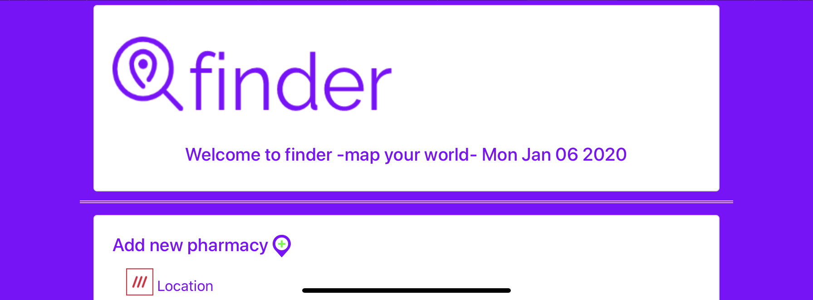
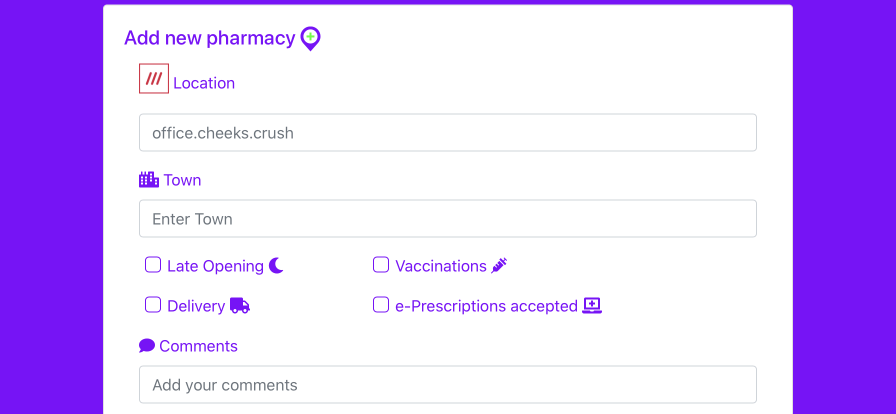
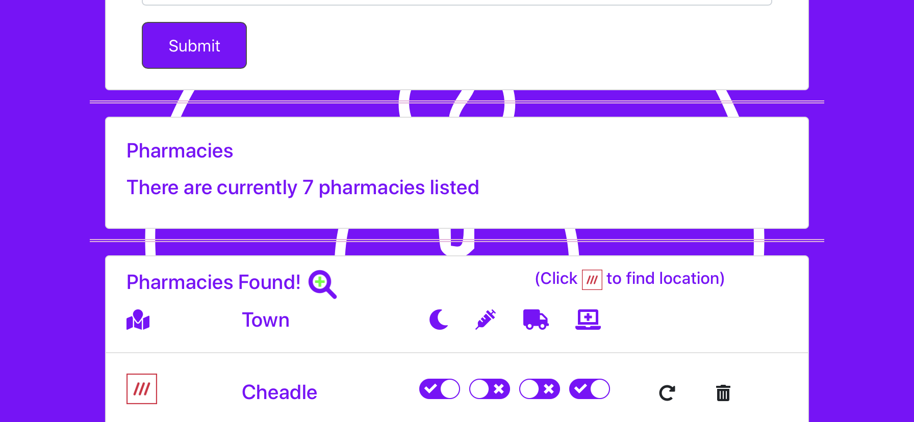
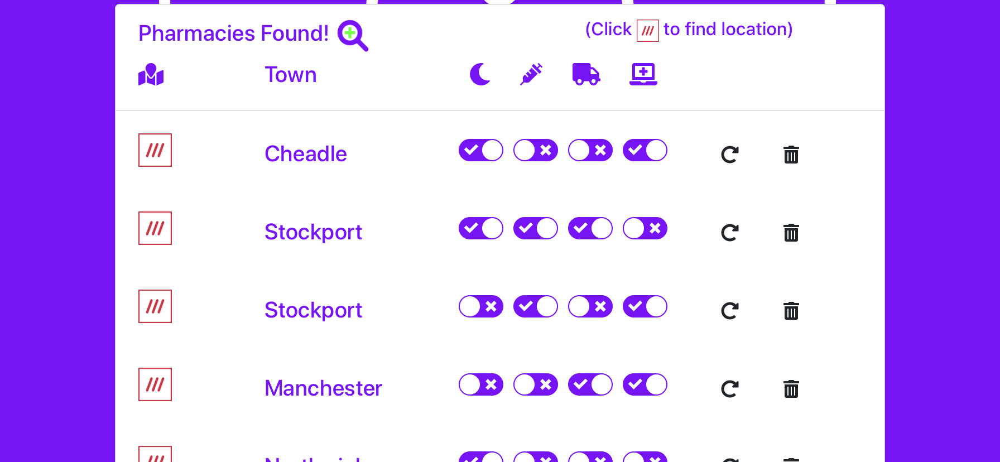
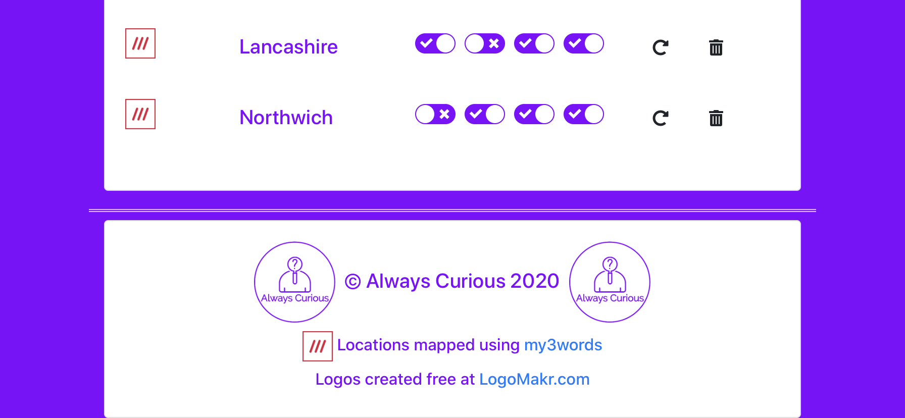

# Finder Application - Frontend
This is the front end of a Finder Application, built as a collaborative final project of the [Tech Returners](https://www.techreturners.com/) Your Journey Into Tech course. It integrates with a backend, available here : https://github.com/EstamosAlwaysCurious/finder_backend.

The hosted version of the application is available here: https://EstamosAlwaysCurious.github.io/finder/.
Tech Returners final project presentation: https://shorturl.at/cwNQZ

### The Application has been designed to:
Provide an MVP for the concept of a finder app for any number of objects using crowdsourced data. For the proof of concept we have chosen to collect data on pharmacies.

The application allows users to input data on pharmacies using [What3Words](https://what3words.com/) to ascribe a unique 3 words to geolocate. A town name, and 4 features (late opening, vaccinations, delivery and e-prescriptions) and comments.

The collected data is stored in an AWS relational database and is displayed as a list where individual pharmacies can updated or deleted. The list includes a link to the What3Words website to show the the location.

### Technology Used
- ReactJS
- JavaScript (ES2015+)
- CSS
- Bootstrap
- Webpack
- Axios
- ESLint
- Jest

It has been designed and built with mobile-first responsive principles in mind.

The application makes use of [Font Awesome](https://www.npmjs.com/package/font-awesome), [Moment](https://www.npmjs.com/package/moment), [React Switch](https://www.npmjs.com/package/react-switch), [React Dialog](https://www.npmjs.com/package/react-dialog) and [Auth0](https://auth0.com/).

Running the application locally
Node.js must be installed if not already.

Clone the application and install dependencies:

    npm install
To start the application:

    npm start
The application will then be accessible at:

http://localhost:3000

This project was bootstrapped with [Create React App](https://github.com/facebook/create-react-app).

